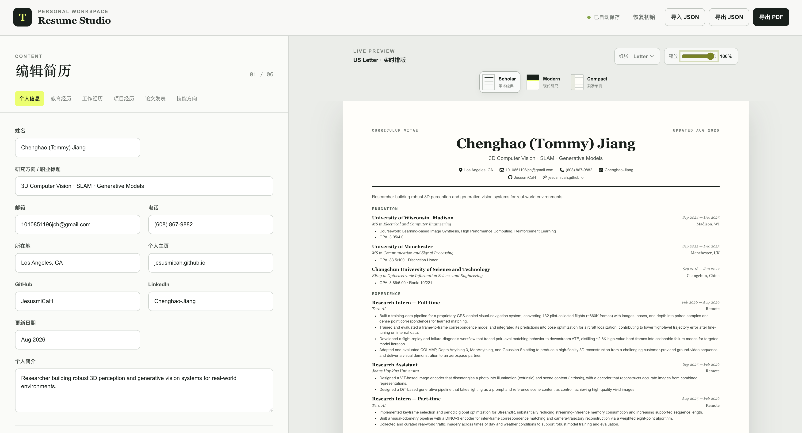

# Resume Studio

Resume Studio is a privacy-first workspace for maintaining a structured resume, previewing it in multiple PDF-ready layouts, and preparing the stories behind each experience for interviews.

The current release focuses on resume editing and export. Interview-design and mock-interview workflows are planned as the next product surface; private interview notes are intentionally excluded from this repository.



## Features

- Edit profile, education, experience, projects, publications, and skills
- Switch the editor interface between English and Chinese, with English as the default
- Preview changes immediately in Scholar, Modern, and Compact templates
- Switch between US Letter and A4 page sizes
- Export a print-ready PDF through the browser
- Import and export portable JSON backups
- Restore the latest draft automatically on the same browser and device
- Open email, phone, GitHub, LinkedIn, and personal-site links directly from the rendered resume
- Keep resume data in browser storage instead of uploading it to a server

## Product direction

Resume Studio is designed around two connected workflows:

1. **Resume editing** — maintain one structured source of truth and render it into different application-ready layouts.
2. **Interview design** — turn resume bullets into accurate narratives, technical walkthroughs, likely follow-up questions, and repeatable mock-interview practice.

Interview-preparation content is personal and is not tracked by Git.

## Local development

Requirements: Node.js 22.13 or newer.

```bash
npm install
npm run dev
```

Create a production build with:

```bash
npm run build
```

## Data and privacy

Resume drafts are stored in the browser's local storage. They persist when the same site is reopened from the same browser profile, but they do not automatically follow the user to another browser or device. JSON export provides a portable backup.

Do not commit personal interview notes, confidential employer information, or exported resume JSON files containing data that should remain private.

## Technology

- React 19
- TypeScript
- vinext and Vite
- Tailwind CSS
- React Icons
- Cloudflare Workers-compatible deployment output
